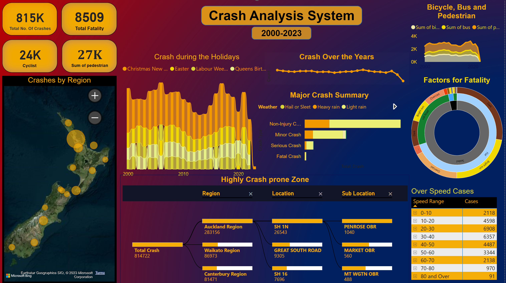
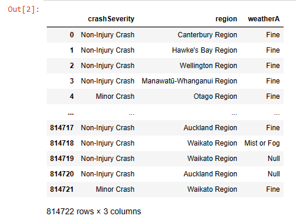
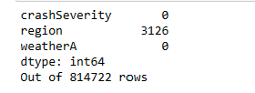
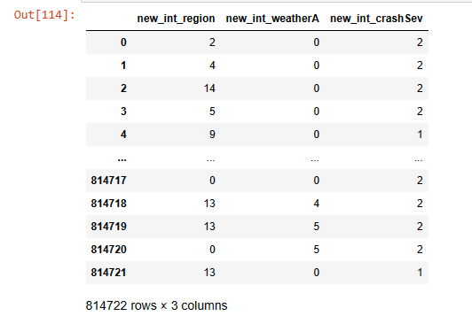
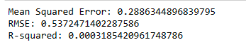
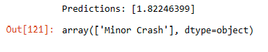

# CRASH ANALYSIS SYSTEM 
### - By Pooja Rawat, MIT 
<br>
<br>
This repository contains artifacts about the Crash Analysis System project built by me during my Data Analysis course in MIT, NZ. The Crash Analysis System project aims to develop a comprehensive and efficient system for analyzing traffic crashes.

<br>

## Sample Data
The sample data used in this report is available in this repository. Due to the high volume of data and github limitation to upload, I removed some records from the file. [Report Data](./Artifacts/SampleData/Crash_Analysis_data.csv)

<br>

## MetaData Information
Information about the attributes used in sample data are defined at [MetaData Information](./DataUnderstanding.md)

<br>

## Artifacts 

Below are the artifacts developed during this project.

1. [PowerBI Dashboard Report File](./Artifacts/CAS_Project_Dashboard.pbix) 

2. [ML Model Notebook](./Artifacts/CAS_ML_Model.ipynb)

<br>

## Advance Analysis Dashboard



<br>

## Machine Learning Model 

```python
!pip install pandas
!pip install sklearn
!pip install numpy
```


```python
import pandas as pd
import numpy as np
df = pd.read_csv('./Crash_Analysis_data.csv')
df
```


```python
df = df.drop(columns=['X','Y','OBJECTID','advisorySpeed','crashYear','areaUnitID','bicycle','bridge','bus','carStationWagon','cliffBank','crashDirectionDescription','crashFinancialYear','crashLocation1','crashLocation2','crashRoadSideRoad','crashSHDescription','debris','directionRoleDescription','ditch','fatalCount','fence','flatHill','guardRail','holiday','houseOrBuilding','intersection','kerb','light','meshblockId','minorInjuryCount','moped','motorcycle','NumberOfLanes','objectThrownOrDropped','otherObject','otherVehicleType','overBank','parkedVehicle','pedestrian','phoneBoxEtc','postOrPole','roadCharacter','roadLane','roadSurface','roadworks','schoolBus','seriousInjuryCount','slipOrFlood','speedLimit','strayAnimal','streetLight','suv','taxi','temporarySpeedLimit','tlaId','tlaName','trafficControl','trafficIsland','trafficSign','train','tree','truck','unknownVehicleType','urban','vanOrUtility','vehicle','waterRiver','weatherB'])
df
```


```python
# pd.set_option('display.max_rows',None)
num_row = df.shape[0]
num_col = df.shape[1]
print(df.isna().sum())
print("Out of",num_row,"rows")
```


```python
from sklearn.preprocessing import LabelEncoder
 
# Creating a instance of label Encoder.
re = LabelEncoder()
we = LabelEncoder()
le = LabelEncoder()
 
# Using .fit_transform function to fit label
# encoder and return encoded label
df['new_int_region'] = re.fit_transform(df['region'])
df.drop("region", axis=1, inplace=True)

df['new_int_weatherA'] = we.fit_transform(df['weatherA'])
df.drop("weatherA", axis=1, inplace=True)

df['new_int_crashSev'] = le.fit_transform(df['crashSeverity'])
df.drop("crashSeverity", axis=1, inplace=True)

df
```


```python
df.info()
df.describe()
df.corr()
```


```python
from sklearn.linear_model import LinearRegression
from sklearn.model_selection import train_test_split
from sklearn.metrics import mean_squared_error, r2_score
from sklearn.metrics import accuracy_score
import numpy as np

X = df[['new_int_region', 'new_int_weatherA']]
y = df['new_int_crashSev']
# Split the data into training and testing sets
X_train, X_test, y_train, y_test = train_test_split(X, y, test_size=0.2, random_state=42)

# Create a linear regression model
model = LinearRegression()

# Train the model using the training data
model.fit(X_train, y_train)

# Make predictions on the test data
y_pred = model.predict(X_test)

# Evaluate the model's performance
mse = mean_squared_error(y_test, y_pred)
print('Mean Squared Error:', mse)

rmse = np.sqrt(mse)
print("RMSE:", rmse)

# Calculate R-squared
r2 = r2_score(y_test, y_pred)
print("R-squared:", r2)
```


```python
# Make predictions on new data Weather 'Mist or Fog' and Region AUCKLAND
new_data = {
    'new_int_region': [14],
    'new_int_weatherA': [5]
}

new_df = pd.DataFrame(new_data)

new_X = new_df[['new_int_region', 'new_int_weatherA']]

predictions = model.predict(new_X)

print("Predictions:", predictions)

le.inverse_transform(predictions.astype(int))

```


<br>

## Conclusion
